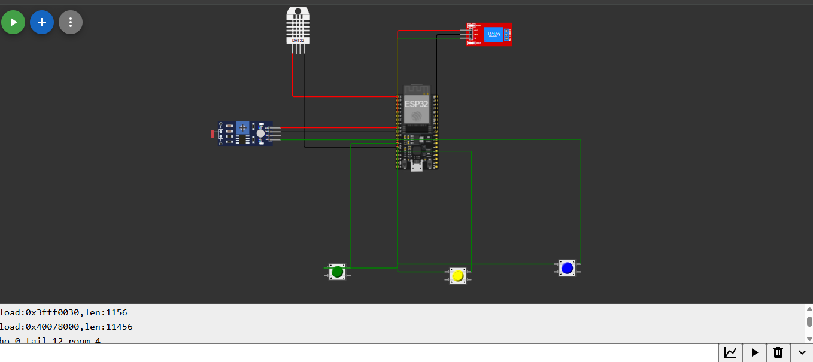

# 🌱 FarmTech Solutions

### Fase 2 — Sistema de Irrigação Inteligente

---

## 📖 Visão Geral

Este projeto representa a evolução de uma solução de **automação agrícola**, focada no cultivo de **Shiitake** e **horticultura**.

Nesta fase, foi desenvolvido um sistema de **irrigação inteligente automatizada**, utilizando o microcontrolador **ESP32**, com base em dados ambientais e regras de negócio.

---

## 🎓 Informações Acadêmicas

**Tutor(a):**
Sabrina Otoni

**Coordenador(a):**
André Godoi

---

## 🎯 Objetivo

Automatizar o processo de irrigação, garantindo:

* Uso eficiente de recursos hídricos 💧
* Monitoramento contínuo das condições do solo 🌱
* Tomada de decisão baseada em dados 📊

---

## ⚙️ Regras de Negócio

A irrigação será **ativada automaticamente** quando todas as condições abaixo forem atendidas:

1. **Umidade do solo** inferior a **60%**
2. **pH do solo** fora da faixa ideal (**5.5 a 7.0**)

   * (Simulado por sensor LDR)
3. **Níveis de nutrientes (NPK)** insuficientes

   * (Simulados por botões)
4. **Condição climática favorável**

   * Irrigação **bloqueada em caso de chuva**, com base na API OpenWeather

---

## 🧩 Arquitetura do Sistema

### 🔌 Hardware (Simulado no Wokwi)

* **DHT22** → Temperatura e umidade do ar
* **LDR** → Simulação de pH do solo
* **Botões (3x)** → Níveis de Nitrogênio (N), Fósforo (P) e Potássio (K)
* **Relé** → Controle da bomba de irrigação

---

## 📂 Estrutura do Projeto

```bash
farmtech-irrigacao/
│
├── src/        # Código principal do ESP32 (.ino)
├── python/     # Integração com API climática
├── r/          # Análise estatística dos dados
├── docs/       # Diagramas e imagens do circuito
└── README.md   # Documentação do projeto
```

---

## 🚀 Execução do Projeto

### 1️⃣ Simulação do Hardware

* Carregue o código da pasta `/src` no simulador **Wokwi**
* Verifique as conexões conforme o arquivo `diagram.json`

### 2️⃣ Integração com API Climática

* Execute o script Python localizado em:

  ```
  /python/clima_api.py
  ```
* Os dados serão enviados via comunicação serial

### 3️⃣ Análise de Dados

* Utilize o script em R:

  ```
  /r/analise_solo.R
  ```
* Responsável por gerar métricas e médias da umidade

---

## 🔄 Fluxo do Sistema

```text
Sensores → ESP32 → Regras de Negócio → Decisão → Relé (Irrigação)
                      ↑
                API Climática
```

---

## 📸 Circuito do Projeto

Imagem representando a montagem do circuito no Wokwi:



---

## 🧠 Tecnologias Utilizadas

* ESP32 (C/C++)
* Python (Integração com API)
* R (Análise de dados)
* Wokwi (Simulação de circuito)
* OpenWeather API

---

## 📌 Considerações Finais

Este projeto demonstra a aplicação prática de:

* IoT na agricultura 🌾
* Integração de múltiplas linguagens 🧩
* Automação baseada em dados 📡

Com potencial de expansão para cenários reais e escaláveis.

---


## 📸 Circuito do Projeto (Wokwi)
Abaixo está a representação visual da montagem do hardware simulado:


## 🛠️ Instruções de Execução
1. Carregue o código da pasta `/src` no Wokwi.
2. Certifique-se de que os pinos seguem o arquivo `diagram.json`.
3. Para integração com a API, utilize o script em `/python`.
